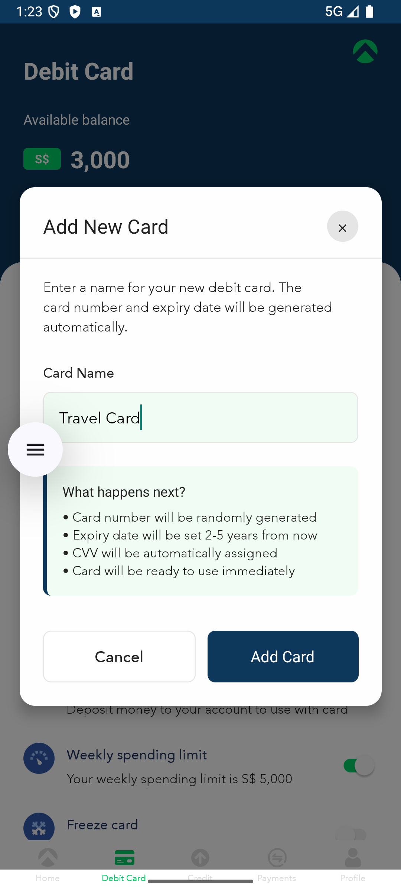

# FirstProject - React Native Debit Card Management App

A modern React Native application for managing debit card spending limits and viewing financial information. Built with Redux Saga for state management and featuring offline-first functionality with fallback data.

## 📱 Features

### Core Functionality

- **Dashboard Screen**: View user balance, debit card details, and spending progress
- **Spending Limit Management**: Set and update weekly spending limits
- **Real-time Progress Tracking**: Visual progress bar showing spending vs. limit
- **Offline Support**: App works seamlessly without internet connectivity using fallback data

### Technical Features

- **Redux Saga**: Advanced state management with side effects handling
- **Fallback Data System**: Graceful degradation when API is unavailable
- **TypeScript**: Full type safety throughout the application
- **Modern UI**: Clean, professional interface with smooth animations
- **Unit Testing**: Comprehensive test coverage for Redux Sagas
- **Cross-platform**: Runs on both Android and iOS

## 📸 Screenshots

### Android

<div align="center">
  
  
  
</div>

<div align="center">
  
  
</div>

### iOS

<div align="center">
  
  
  
</div>

<div align="center">
  
  
</div>

### Key Features Demonstrated

| Feature             | Description                                                     |
| ------------------- | --------------------------------------------------------------- |
| **Dashboard**       | Main screen showing balance, active card, and spending progress |
| **Spending Limits** | Weekly spending limit configuration and tracking                |
| **Add New Card**    | Modal for adding new debit cards with validation                |
| **Freeze/Unfreeze** | Card security feature with visual frozen state                  |
| **Settings Menu**   | Comprehensive card and account settings                         |

## 🏗 Project Structure

```
FirstProject/
├── src/
│   ├── components/          # Reusable UI components
│   │   ├── Button/
│   │   ├── DebitCard/
│   │   ├── DashboardHeader/
│   │   └── SpendingProgress/
│   ├── screens/            # Screen components
│   │   ├── Dashboard/
│   │   └── SpendingLimit/
│   ├── store/              # Redux store configuration
│   │   ├── sagas/          # Redux Saga files
│   │   ├── slices/         # Redux Toolkit slices
│   │   └── __tests__/      # Unit tests
│   ├── services/           # API services
│   ├── constants/          # App constants and fallback data
│   ├── navigation/         # Navigation configuration
│   └── assets/            # Images, fonts, and icons
├── mock-data/             # Mock API server data
├── android/               # Android-specific files
├── ios/                   # iOS-specific files
└── __tests__/            # App-level tests
```

## 🚀 Quick Start

### Prerequisites

- **Node.js**: >= 16.x
- **npm** or **yarn**

### Installation

1. **Clone the repository**

   ```bash
   git clone <repository-url>
   cd FirstProject
   ```

2. **Install dependencies**

   ```bash
   npm install
   ```

3. **Install iOS dependencies** (macOS only)
   ```bash
   cd ios && pod install && cd ..
   ```

## 🔧 Development Setup

### Option 1: With Mock API Server (Recommended for Development)

#### Start Mock API Server

```bash
# Start the mock server on port 3001
npm run mock-api

# Server will be available at:
# http://localhost:3001 (local)
# http://YOUR_IP:3001 (network - for React Native)
```

#### Update API Configuration

1. Find your computer's IP address:

   ```bash
   # macOS/Linux
   ifconfig | grep "inet " | grep -v 127.0.0.1

   # Windows
   ipconfig
   ```

2. Update `src/services/api.ts`:
   ```typescript
   const BASE_URL = 'http://YOUR_IP_ADDRESS:3001';
   ```

### Option 2: Offline Mode (Fallback Data Only)

The app automatically uses fallback data when the API server is unavailable. No additional setup required - just run the app!

## 📱 Running the Application

### Android

#### Android Emulator

```bash
# Start Android emulator first (via Android Studio or command line)
# Then run:
npm run android
```

#### Android Real Device

1. **Enable Developer Options**:

   - Go to Settings > About Phone
   - Tap "Build Number" 7 times
   - Go back to Settings > Developer Options
   - Enable "USB Debugging"

2. **Connect device via USB**

   ```bash
   # Check if device is connected
   adb devices

   # Run the app
   npm run android
   ```

3. **Wireless Connection** (Alternative):

   ```bash
   # Connect via USB first, then:
   adb tcpip 5555
   adb connect YOUR_DEVICE_IP:5555

   # Now you can disconnect USB and run:
   npm run android
   ```

### iOS

#### iOS Simulator (macOS only)

```bash
# Run on iOS simulator
npm run ios

# Or specify a specific simulator
npx react-native run-ios --simulator="iPhone 14"
```

#### iOS Real Device (macOS only)

1. **Setup Apple Developer Account**:

   - Open `ios/FirstProject.xcworkspace` in Xcode
   - Select your development team
   - Configure signing certificates

2. **Run on device**:
   ```bash
   # Connect device via USB and run:
   npx react-native run-ios --device
   ```

## 📦 Building for Production

### Android APK/AAB

#### Debug APK (for testing)

```bash
cd android
./gradlew assembleDebug
# APK location: android/app/build/outputs/apk/debug/app-debug.apk
```

#### Release APK

```bash
# Generate signing key (first time only)
keytool -genkeypair -v -storetype PKCS12 -keystore my-upload-key.keystore -alias my-key-alias -keyalg RSA -keysize 2048 -validity 10000

# Build release APK
cd android
./gradlew assembleRelease
# APK location: android/app/build/outputs/apk/release/app-release.apk
```

#### Android App Bundle (for Play Store)

```bash
cd android
./gradlew bundleRelease
# AAB location: android/app/build/outputs/bundle/release/app-release.aab
```

### iOS Build (macOS only)

#### iOS Simulator Build

```bash
npx react-native run-ios --configuration Release
```

#### iOS Device/App Store Build

1. Open `ios/FirstProject.xcworkspace` in Xcode
2. Select "Any iOS Device" or your connected device
3. Product → Archive
4. Follow Xcode's distribution workflow

## 🧪 Testing

### Run All Tests

```bash
npm test
```

### Run Saga Tests Only

```bash
npm run test:sagas
```

### Test Coverage

```bash
npm test -- --coverage
```

## 🔧 Configuration

### API Configuration

Update `src/services/api.ts` to configure API endpoints:

```typescript
const BASE_URL = 'http://YOUR_SERVER_URL:PORT';
```

### Fallback Data

Modify fallback data in `src/constants/data.ts`:

```typescript
export const FALLBACK_USER_DATA = {
  id: 1,
  name: 'Your Name',
  availableBalance: 3000,
  currency: 'S$',
};
```

## 📊 Mock Data Structure

The mock API server (`mock-data/db.json`) contains:

- **User data**: Name, balance, currency
- **Debit card data**: Card details, holder name, expiry
- **Spending limits**: Weekly limits, current spending, status
- **Transactions**: Transaction history
- **Card settings**: Various card configuration options

## 🔍 Troubleshooting

### Common Issues

#### Metro Bundler Issues

```bash
# Reset Metro cache
npx react-native start --reset-cache

# Kill existing Metro process
lsof -ti:8081 | xargs kill -9
```

#### Android Build Issues

```bash
# Clean Android build
cd android && ./gradlew clean && cd ..

# Reset packages
rm -rf node_modules && npm install
```

#### iOS Build Issues (macOS only)

```bash
# Clean iOS build
cd ios && xcodebuild clean && cd ..

# Reinstall pods
cd ios && rm -rf Pods && pod install && cd ..
```

#### Network Issues

- Ensure your device/emulator can reach the mock server
- Check firewall settings
- Verify IP address configuration in `api.ts`
- Test API accessibility: `curl http://YOUR_IP:3001/user`

### Port Conflicts

```bash
# Kill process on port 3001 (mock server)
lsof -ti:3001 | xargs kill -9

# Kill process on port 8081 (Metro)
lsof -ti:8081 | xargs kill -9
```
